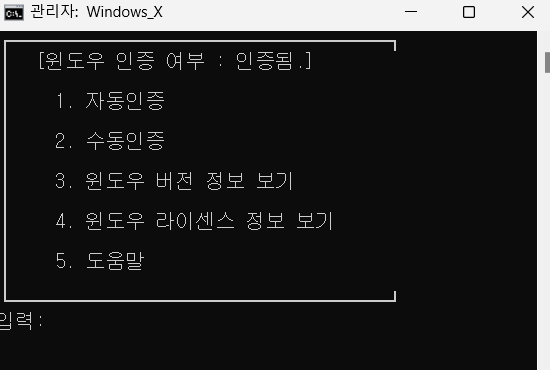
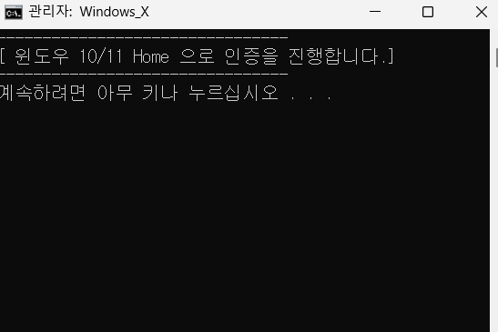
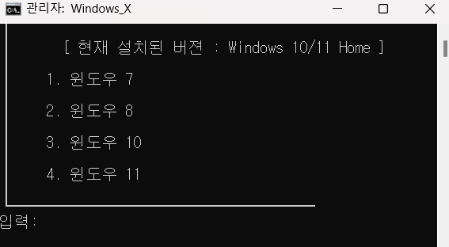
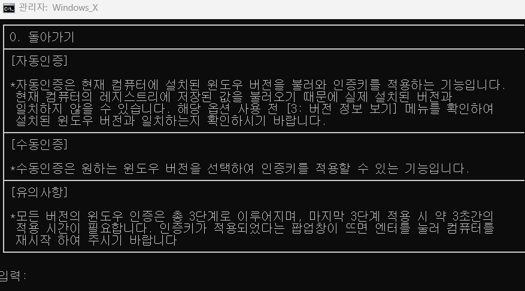

# windowsX
윈도우 7, 8, 10, 11 Home/Pro 인증을 수행하는 배치파일 툴
## 🚀 주요 기능
- 자동인증(현재 설치된 윈도우 버전에 맞는 인증 수행)
- 수동인증(윈도우 버전을 특정하여 인증 수행)
## 💻 사용 방법
1. Windows_X 를 관리자 권한으로 실행
2. 4번 옵션을 선택하여 현재 윈도우가 인증 상태인지 확인
3. 1번 옵션을 선택하여 인증 수행
## 🔧 시스템 요구사항
- 본 프로그램은 윈도우 환경에서 동작함. 
## ⚠️ 주의사항
- 사용시 발생하는 모든 문제에 대한 책임은 본인에게 있음

## 📷 스크린샷
플래비와의 대화 예시 화면입니다:

